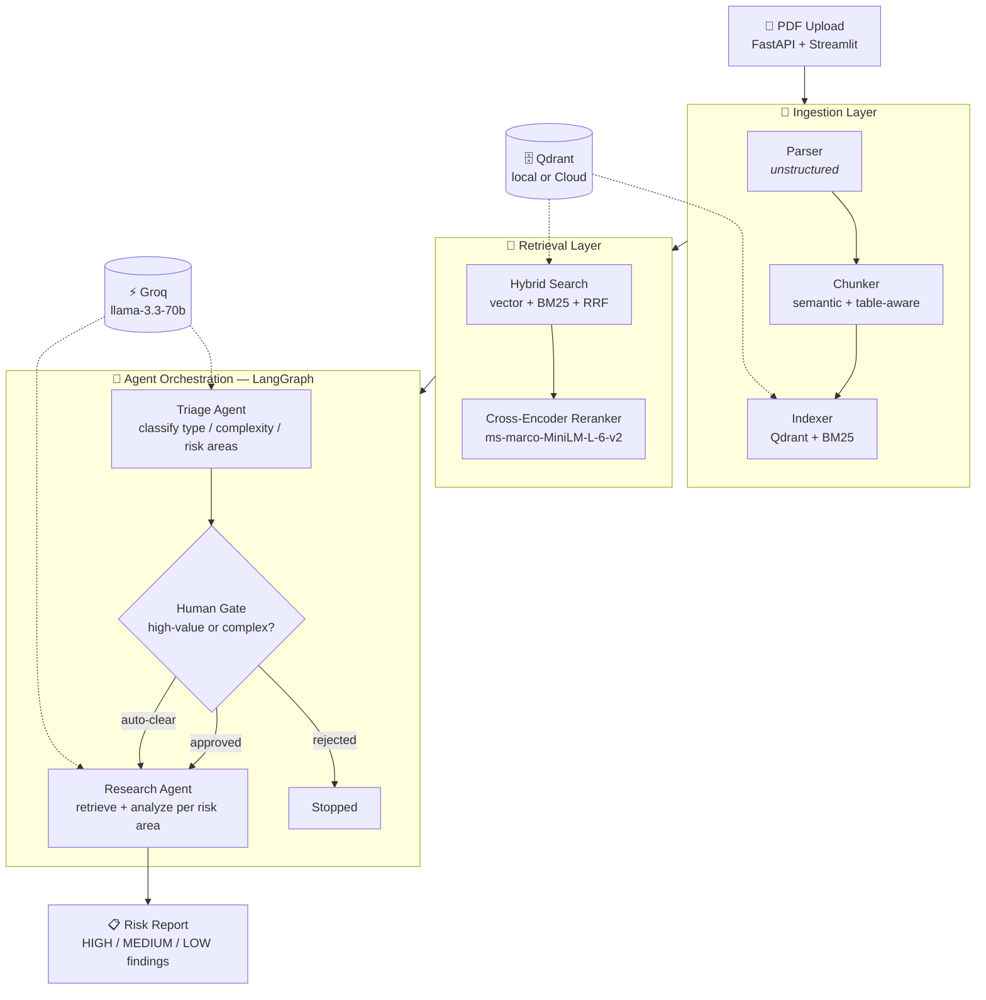

<div align="center">

# 🔍 ContractLens

### *Autonomous Contract Risk Analysis — Powered by Multi-Agent AI*

<br/>

[](https://python.org)
[](https://fastapi.tiangolo.com)
[](https://streamlit.io)
[](https://langchain.com)
[](https://groq.com)
[](https://qdrant.tech)
[](LICENSE)

<br/>

> **ContractLens** goes far beyond "chat with PDF". It autonomously parses, indexes, triages, and analyzes legal contracts — surfacing HIGH / MEDIUM / LOW risk findings with human-in-the-loop oversight for high-stakes documents.

<br/>

---

</div>

## 🌟 What Makes ContractLens Different?

Most tools stop at answering questions. ContractLens runs a **full multi-agent pipeline**:

| 🔧 Step | 📋 What Happens |
|:---:|:---|
| 📄 **Parse** | Contracts are parsed preserving tables, headings & clause structure |
| 🗂️ **Index** | Hybrid vector + BM25 keyword search index is built per document |
| 🎯 **Triage** | AI agent classifies type, complexity & risk areas automatically |
| 🧑‍⚖️ **Human Gate** | Pipeline pauses for approval on high-value or complex contracts |
| 🔍 **Retrieve** | Relevant clauses retrieved using reranked hybrid search per risk area |
| 📊 **Report** | Structured risk report with **HIGH** / **MEDIUM** / **LOW** findings |
| 💰 **Track** | Per-analysis cost tracking exposed via REST API |

---

## 🏗️ Architecture



---

## 📈 Benchmark Results

> Evaluation across **15 test cases** (easy / medium / hard) covering **6 clause categories**

### 🏆 Overall Performance

| Metric | 🔴 Baseline (pure vector) | 🟢 Final (hybrid + rerank) | 📈 Change |
|:---|:---:|:---:|:---:|
| **Exact Match** | 0.178 | **0.867** | 🚀 +387% |
| **Faithfulness** | 0.793 | **0.793** | ➡️ — |
| **Answer Relevancy** | 0.860 | **0.860** | ➡️ — |
| **Context Precision** | 0.267 | **0.271** | ↑ +1.5% |

### 📊 Performance by Difficulty

| Difficulty | Exact Match | Faithfulness | Answer Relevancy |
|:---:|:---:|:---:|:---:|
| 🟢 **Easy** | `1.000` | `0.940` | `1.000` |
| 🟡 **Medium** | `0.875` | `0.775` | `0.862` |
| 🔴 **Hard** | `0.500` | `0.500` | `0.500` |

### 🗂️ Performance by Category

| Category | Exact Match | Faithfulness |
|:---:|:---:|:---:|
| 💳 Payment | `1.000` | `1.000` |
| ⚖️ Liability | `1.000` | `1.000` |
| 🔚 Termination | `1.000` | `1.000` |
| 📜 Compliance | `1.000` | `0.850` |
| 🔒 Confidentiality | `0.750` | `0.550` |
| 💡 IP | `0.500` | `0.500` |

> **Note:** Hard queries (cross-document comparison, negation) remain the known limitation. Context precision of 0.271 indicates retrieval casts a wide net — a targeted retrieval strategy per risk area is the next improvement.

---

## 🛠️ Tech Stack

| Layer | Technology |
|:---|:---|
| 📄 **PDF Parsing** | `unstructured` — `fast` strategy (no Tesseract/Poppler needed) |
| 🗄️ **Vector Store** | Qdrant — local embedded or Qdrant Cloud |
| 🔑 **Keyword Search** | BM25 (`rank-bm25`) |
| 🔀 **Result Fusion** | Reciprocal Rank Fusion (RRF) |
| 🎯 **Reranking** | `cross-encoder/ms-marco-MiniLM-L-6-v2` |
| ⚡ **LLM** | Groq — `llama-3.3-70b-versatile` (no OpenAI dependency!) |
| 🤖 **Agent Framework** | LangGraph state machine |
| 🧠 **Embeddings** | `sentence-transformers/all-MiniLM-L6-v2` — runs **locally**, no API cost |
| 🚀 **API** | FastAPI + SlowAPI rate limiting |
| 🎨 **UI** | Streamlit |
| 📏 **Evaluation** | Custom metrics + LLM-as-judge |

> 💡 **Zero OpenAI dependency** — Chat/reasoning runs on Groq and embeddings run locally. `src/contractlens/core/llm.py` is the single place to swap providers.

---

## 📁 Project Structure

```
contractlens/
├── 📂 docs/
│   └── DEPLOY.md                   # Render deployment guide
├── 📂 data/
│   ├── raw/                        # Original PDFs (gitignored)
│   ├── processed/                  # Parsed JSON, chunks, indexes
│   └── evaluation/                 # Test cases and results
├── 📂 src/
│   └── contractlens/               # Package namespace
│       ├── 🧠 core/                # LLM, logging, token tracking
│       │   ├── llm.py
│       │   ├── logging_config.py
│       │   └── token_usage.py
│       ├── 📄 ingestion/           # PDF parsing, chunking, indexing
│       │   ├── parser.py
│       │   ├── chunker.py
│       │   └── indexer.py
│       ├── 🔍 retrieval/           # Hybrid search & cross-encoder reranker
│       │   ├── hybrid.py
│       │   └── reranker.py
│       ├── 🤖 agents/              # LangGraph state machine & agents
│       │   ├── triage.py
│       │   ├── research.py
│       │   └── graph.py
│       ├── 📊 evaluation/          # Metrics & benchmark runner
│       │   ├── testset.py
│       │   ├── metrics.py
│       │   └── runner.py
│       └── 🚀 api/                 # FastAPI backend & cost tracker
│           ├── main.py
│           └── cost_tracker.py
├── 🎨 ui/
│   └── app.py                      # Streamlit interface
├── 🧪 tests/                       # Pytest suite
├── requirements.txt
└── .env
```

---

## ⚡ Quick Start

### 1️⃣ Clone and Install

```bash
git clone https://github.com/rahulbicky/contract-analysis-tool
cd contract-analysis-tool
python -m venv env
env\Scripts\activate        # Windows
# source env/bin/activate   # Mac/Linux
pip install -r requirements.txt
```

### 2️⃣ Configure Environment

```bash
cp .env.example .env
```

Fill in `.env`:

```env
# ⚡ Groq — free tier at https://console.groq.com
GROQ_API_KEY=your_key_here
GROQ_MODEL=llama-3.3-70b-versatile

# 🧠 Embeddings — run locally, no API cost
EMBEDDING_MODEL=sentence-transformers/all-MiniLM-L6-v2
EMBEDDING_DIM=384

# 🗄️ Qdrant — local embedded mode (no Docker needed)
QDRANT_HOST=localhost
QDRANT_PORT=6333

# 🔐 ContractLens API — set any secret key
CONTRACTLENS_API_KEY=your_own_arbitrary_key
CONTRACTLENS_ALLOWED_ORIGINS=http://localhost:8501
CONTRACTLENS_MAX_UPLOAD_MB=20
CONTRACTLENS_API_URL=http://localhost:8000
```

### 3️⃣ Launch the App

Open **two terminals** and run:

```bash
# 🖥️ Terminal 1 — FastAPI Backend
$env:PYTHONPATH="src"
uvicorn src.contractlens.api.main:app --host 0.0.0.0 --port 8000 --reload
```

```bash
# 🎨 Terminal 2 — Streamlit UI
streamlit run ui/app.py
```

Then open 👉 **http://localhost:8501**

---

## 🌐 API Reference

| Endpoint | Method | 🔐 Auth | Description |
|:---|:---:|:---:|:---|
| `/analyze` | `POST` | ✅ | Upload PDF, run triage + research |
| `/approve/{thread_id}` | `POST` | ✅ | Approve or reject human gate |
| `/status/{thread_id}` | `GET` | ✅ | Check pipeline status |
| `/costs` | `GET` | ✅ | Cost summary for all requests |
| `/health` | `GET` | ❌ | Health check |

### 💻 Example

```bash
# 📤 Upload contract
curl -X POST http://localhost:8000/analyze \
  -H "X-API-Key: your_key" \
  -F "file=@contract.pdf"

# ✅ Returns:
{
  "thread_id": "abc-123",
  "status": "pending_approval",
  "triage": {
    "document_type": "ServiceAgreement",
    "complexity": "high",
    "risk_areas": ["payment", "liability", "termination", "IP"]
  }
}

# 👍 Approve
curl -X POST http://localhost:8000/approve/abc-123 \
  -H "X-API-Key: your_key" \
  -H "Content-Type: application/json" \
  -d '{"approved": true, "notes": "Standard contract"}'
```

---

## 🧠 Key Design Decisions

<details>
<summary><b>🔀 Why hybrid search over pure vector search?</b></summary>

Pure vector search misses exact keyword matches — contract clause numbers, specific dollar amounts, legal terms. BM25 catches these. RRF fusion combines both rankings without requiring score normalization.

</details>

<details>
<summary><b>✂️ Why semantic chunking over fixed-size chunking?</b></summary>

Contracts have variable-length clauses. Fixed-size chunks cut mid-sentence. Semantic chunking splits on meaning boundaries, keeping clauses intact. Tables are never split regardless of size.

</details>

<details>
<summary><b>🎯 Why cross-encoder reranking?</b></summary>

Bi-encoders (used in vector search) encode query and document independently. Cross-encoders see both together, giving dramatically better relevance judgments. Reranking only the top-20 candidates keeps latency acceptable.

</details>

<details>
<summary><b>🧑‍⚖️ Why human-in-the-loop?</b></summary>

High-value contracts ($100k+) with multiple risk areas should never be auto-processed in production. LangGraph's checkpoint system allows the pipeline to **pause mid-execution** and resume after human approval without losing state.

</details>

---

## 📏 Evaluation Methodology

Custom metrics rather than off-the-shelf RAGAS:

| Metric | Description |
|:---|:---|
| 🎯 **Exact Match** | Key facts from ground truth present in prediction (normalized for number formats) |
| 🔒 **Faithfulness** | LLM-as-judge: does every claim appear in retrieved context? |
| 💬 **Answer Relevancy** | LLM-as-judge: does the answer address the question? |
| 📐 **Context Precision** | Are retrieved chunks actually useful for answering? |

> 📋 Test set: **15 hand-labeled cases** (5 easy, 7 medium, 3 hard) across payment, liability, termination, IP, confidentiality, and compliance categories. Includes one cross-document comparison case.

---

## ⚠️ Known Limitations

> [!NOTE]
> These are actively being worked on.

- **Context Precision (0.271)** — Retrieval cast a wide net across all documents. **Partially fixed**: `hybrid_search()` now accepts a `filename_filter` backed by a Qdrant payload index. Verified: without filter, unrelated document chunks leaked into top candidates; with filter, they're excluded and faithfulness improved (0.2 → 0.6).

- **Hard Queries score 0.50** — Cross-document comparison and negation detection require multi-hop reasoning not currently implemented.

- **Model load time** — Reranker model (90MB) loads on first request. Pre-loading via FastAPI startup event mitigates this after first boot.

- **Cost tracking** — Currently uses estimated token counts rather than actual API usage.

---

## 📦 Requirements

See [`requirements.txt`](requirements.txt) for exact pinned versions:

```
langchain · langchain-groq · langchain-huggingface · langgraph
qdrant-client
unstructured[pdf] · pikepdf · pdfminer.six
rank-bm25 · sentence-transformers
fastapi · uvicorn · python-multipart · slowapi · httpx
streamlit
python-dotenv · pydantic · langsmith
pytest
```

---

<div align="center">

## 📄 License

**MIT** — Free to use, modify and distribute.

<br/>

---

*Built with ❤️ using LangGraph, Groq, Qdrant & Streamlit*

[](https://github.com/rahulbicky/contract-analysis-tool)

</div>
